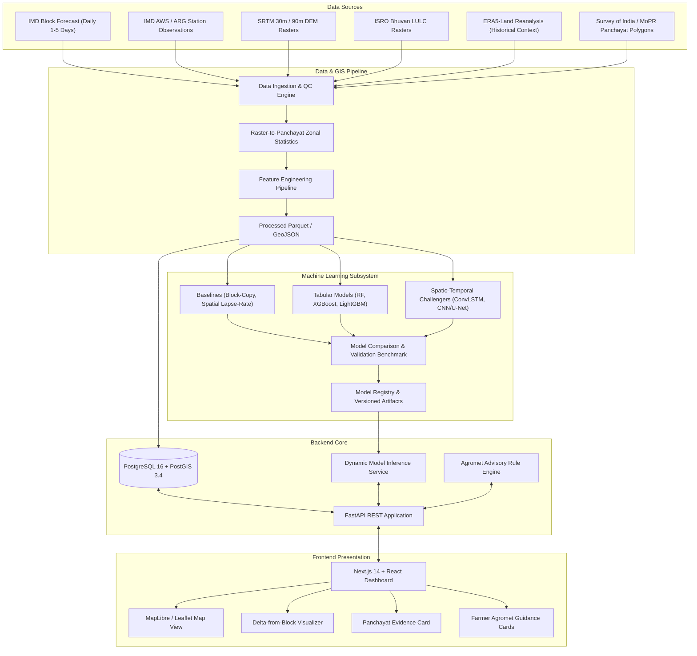

# System Architecture — PanchayatCast (SIH26074)

## 1. High-Level Architecture Overview

PanchayatCast implements a decoupled multi-tier architecture separating data ingestion, spatial analysis, model training/inference, API delivery, and user presentation.

---

## 2. Core Architectural Components

### 2.1 Geospatial & Feature Pipeline (`gis/` and `ml/common/`)
- Ingests official administrative boundaries down to the Gram Panchayat level.
- Computes static physiographic features for every Panchayat polygon:
  - Mean elevation, standard deviation of elevation (roughness).
  - Slope gradient and aspect (solar insolation index).
  - Land cover distribution fractions (% agricultural, % forest canopy, % water bodies, % built-up).
- Aligns dynamic weather variables (block forecast, antecedent rainfall lags, temperature trends) to Panchayat centroids.

### 2.2 Machine Learning & Evaluation Subsystem (`ml/`)
- Completely decoupled model workspaces.
- Standard input/output contracts so the backend does not care whether a prediction was produced by XGBoost or ConvLSTM.
- Independent spatial validation against physical AWS/ARG ground stations.

### 2.3 Relational & Spatial Database (`database/`)
- PostgreSQL 16 with PostGIS extension.
- Stores administrative hierarchies, geometries, daily forecasts, predictions, uncertainty intervals, model registries, and advisory rules.

### 2.4 Application Backend (`backend/`)
- High-concurrency asynchronous API written in FastAPI.
- Dynamically loads approved models from the model registry.
- Computes difference-from-block and evaluates advisory rules on demand or during batch forecast ingest.

### 2.5 Modern Frontend Dashboard (`frontend/`)
- Built with Next.js and TypeScript.
- Allows intuitive exploration of forecasts at State $\rightarrow$ District $\rightarrow$ Block $\rightarrow$ Panchayat level.
- Provides interactive visual verification of why downscaling matters.
